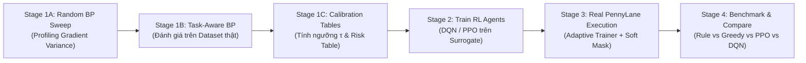

# AL-QNN: Adaptive Layered Quantum Neural Networks with Reinforcement Learning

> **Adaptive Layered Variational Quantum Circuits for Mitigating Barren Plateaus in Real-World Industrial & Biomedical Classification**

[](https://www.python.org/)
[](https://pennylane.ai/)
[](https://pytorch.org/)
[](LICENSE)

---

## 📌 Tổng Quan Dự Án (Overview)

Trong học máy lượng tử biến phân (Variational Quantum Machine Learning), hiện tượng **Barren Plateau (Vùng đất cằn cỗi - BP)** là rào cản lớn nhất đối với việc mở rộng quy mô. Khi số lượng qubit ($n$) và độ sâu mạch ($L$) tăng lên, phương sai gradient của hàm mục tiêu bị triệt tiêu theo hàm mũ:
$$\text{Var}[\partial_{\theta} \mathcal{C}] \in \mathcal{O}(2^{-n})$$
Hiện tượng này khiến việc tối ưu hóa dựa trên gradient (Gradient Descent, Adam) bị tê liệt hoàn toàn.

**AL-QNN** giải quyết triệt để vấn đề này thông qua cơ chế **Kiến trúc Mạch Thích Ứng theo Thời Gian Thực (Dynamic Adaptive Architecture)**:
1. **Khởi đầu mạch nông**: Mạch bắt đầu ở độ sâu tối thiểu ($L=2$), nơi gradient còn khỏe và dồi dào.
2. **Điều khiển tăng trưởng thông minh (Intelligent Scheduling)**: Sử dụng các tác nhân Học tăng cường (**DQN, PPO**) kết hợp **Telemetry Engine** để theo dõi gradient variance, loss floor, và entropy biểu diễn, từ đó chỉ thêm lớp (`add_layer`) hoặc điều tiết vướng víu (`reduce_entanglement`) khi thực sự cần thiết.
3. **Cơ chế Soft-Masking**: Các lớp mới được đưa vào dưới dạng tham số mềm $\theta \rightarrow \alpha(t)\theta$ giúp mạch chuyển tiếp êm ái mà không gây sốc gradient.

---

## 🏛️ Kiến Trúc Hệ Thống (Pipeline 4 Giai Đoạn)



1. **Stage 1A (Random BP Sweep)**: Khảo sát hiện tượng BP trên mạch Haar-like, đo lường tốc độ suy giảm phương sai gradient theo độ sâu và topology.
2. **Stage 1B (Task-Aware BP)**: Khảo sát ảnh hưởng của dữ liệu thực tế (Angle Embedding) đối với hiện tượng BP.
3. **Stage 1C (Calibration Builder)**: Xây dựng bảng quy tắc chẩn đoán tự động, tạo các ngưỡng quyết định gradient $\tau$.
4. **Stage 2 (RL Schedulers Training)**: Huấn luyện các Agent PPO và DQN trên môi trường mô phỏng Surrogate nhanh gấp hàng nghìn lần so với mạch thật.
5. **Stage 3 & 4 (Real Execution & Evaluation)**: Triển khai các Scheduler lên mạch lượng tử thật thông qua PennyLane (`lightning.qubit`, `lightning.gpu`), đối chứng trực tiếp với các mô hình Machine Learning Cổ điển (Random Forest, SVM, Logistic Regression).

---

## ⚙️ Đột Phá: Giải Quyết Mất Cân Bằng Dữ Liệu với Cyclic Partitioned Undersampling

Trên các tập dữ liệu công nghiệp thực tế như **AI4I 2020 Predictive Maintenance (Bảo trì dự đoán)**:
- Tổng số mẫu: **10,000 mẫu**.
- Lớp hỏng hóc (Failure - Class 1): chỉ có **339 mẫu (3.4%)**.
- Lớp bình thường (Normal - Class 0): **9,661 mẫu (96.6%)**.

### Tại sao KHÔNG dùng SMOTE cho QNN?
- SMOTE sinh mẫu nhân tạo bằng cách nội suy tuyến tính trong không gian Euclid cổ điển. Khi nạp vào không gian Hilbert thông qua Angle Embedding, các điểm nhân tạo này gây méo mó phân phối trạng thái lượng tử và làm tăng kích thước tập dữ liệu lên $\approx 19,000$ mẫu, khiến thời gian mô phỏng lượng tử kéo dài hàng chục giờ.

### Giải pháp: Cyclic Partitioned Undersampling (BalanceCascade)
- **Bảo toàn 100% dữ liệu gốc**: Giữ nguyên toàn bộ 237 mẫu lỗi trong tập train, chia 6,763 mẫu bình thường thành **29 chunks** không trùng lặp.
- **Batch 50:50 luân phiên**: Mỗi epoch, 1 chunk bình thường mới được ghép với toàn bộ 237 mẫu lỗi $\rightarrow$ tạo thành batch cân bằng gồm 474 mẫu.
- **Bao phủ toàn diện**: Sau 29 epochs, mô hình đã học trọn vẹn 100% dữ liệu thực tế mà **không sinh bất kỳ điểm ảo nào**, tốc độ huấn luyện nhanh gấp **40 lần**!

---

## 📊 Kết Quả Thực Nghiệm Nổi Bật (AI4I Predictive Maintenance)

### 1. Thử nghiệm trên Mạch 8 Qubits (Bảo toàn 100% Cảm Biến Gốc - Không qua PCA)
Khi sử dụng **8 Qubits**, toàn bộ 5 biến cảm biến liên tục (*Air Temp, Process Temp, Speed, Torque, Tool Wear*) và 3 biến phân loại máy (*Type L, M, H*) được mã hóa trực tiếp vào 8 qubits mà không bị nén qua PCA.

| Scheduler | Acc Bắt đầu | Acc Kết thúc | $\Delta$ Acc | F1-Score | ROC-AUC | Depth Cuối | Commits / Rollbacks |
| :--- | :---: | :---: | :---: | :---: | :---: | :---: | :---: |
| **DQN (RL)** | 64.87% | **95.53%** | **+30.67%** | **0.4806** | **0.8661** | **6** | **5 / 0** |
| **Greedy** | 64.87% | 78.27% | +13.40% | 0.2010 | 0.8708 | 8 | 6 / 0 |
| **Rule-based** | 64.87% | 67.33% | +02.47% | 0.1581 | 0.8702 | 6 | 4 / 0 |
| **PPO (RL)** | 64.80% | 33.73% | -31.07% | 0.0881 | 0.6535 | 7 | 6 / 0 |

> 💡 **Điểm sáng**: Tác nhân **DQN** điều khiển tăng trưởng mạch vô cùng tối ưu: dừng ở độ sâu 6 lớp (chỉ **144 tham số**), đạt **Accuracy 95.53%** và **F1-Score = 0.4806** (cao gấp hơn 2 lần so với mạch 6 qubits).

### 2. So sánh đối chứng với Machine Learning Cổ Điển (Trên cùng tập Test 1,500 mẫu)

| Mô hình | Thuộc tính | Accuracy | F1-Score | ROC-AUC |
| :--- | :--- | :---: | :---: | :---: |
| **AL-QNN (DQN)** | **Mạch Lượng Tử (144 tham số)** | **95.53%** | **0.4806** | **0.8661** |
| Random Forest (200 trees) | Cổ điển (Ensemble Cây) | 87.93% | 0.3370 | 0.9572 |
| Support Vector Machine (RBF) | Cổ điển (Kernel Trick) | 84.93% | 0.2938 | 0.9326 |
| Logistic Regression | Cổ điển (Tuyến tính) | 81.80% | 0.2353 | 0.9048 |

---

## 📁 Cấu Trúc Mã Nguồn (Project Structure)

```
al_qnn_project/
├── src/
│   └── synthetic_bp/
│       ├── stage1a/           # HEA ansatz (Z-Y-Z CNOT), observables, metric engine
│       ├── stage1b/           # Task-aware benchmarking framework
│       ├── stage1c/           # Threshold & calibration table generators
│       ├── stage2/            # SchedulerBase, RuleBased, Greedy, RLScheduler
│       └── stage3/            # CircuitBackend, PennyLaneBackend, AdaptiveTrainer
├── scripts/
│   ├── dataset.py             # Dataloader + BalancedBatchSampler (Cyclic Chunks)
│   ├── 01b_run_task_aware_bp.py
│   ├── 01c_build_calibration.py
│   ├── 04_train_rl_scheduler.py
│   ├── 05_compare_schedulers.py   # So sánh đa scheduler trên PennyLane
│   └── 07_classical_baseline.py   # Chạy đối chứng Random Forest, SVM, LogReg
├── configs/                   # File cấu hình YAML cho các thí nghiệm
├── data/                      # Dữ liệu CSV (Predictive Maintenance, Heart,...)
├── outputs/
│   ├── comparison/            # Bảng tổng hợp CSV, đồ thị PNG, deploy logs
│   ├── rl_results/            # Checkpoint trọng số của agent RL (.pt)
│   └── stage1c/               # Bảng calibration rules JSON
├── al_qnn_studio/             # Giao diện Web Visualizer tương tác
└── README.md
```

---

## 🚀 Hướng Dẫn Cài Đặt & Chạy Thử Nghiệm

### 1. Cài đặt Môi trường
```bash
git clone git@github.com:LeNam123456/AL_QNN.git
cd AL_QNN

# Khởi tạo môi trường ảo Python
python -m venv .venv
source .venv/bin/activate  # Trên Linux / macOS
# Hoặc: .venv\Scripts\activate trên Windows

# Cài đặt các thư viện cần thiết
pip install -r requirements.txt
# Bao gồm: pennylane, pennylane-lightning, torch, scikit-learn, pandas, numpy, matplotlib
```

### 2. Chạy So Sánh Schedulers trên PennyLane (Predictive Maintenance 8 Qubits)
```bash
python scripts/05_compare_schedulers.py \
    --backend pennylane \
    --device-name lightning.qubit \
    --dataset predictive_maintenance \
    --n-qubits 8 \
    --initial-depth 2 \
    --max-depth 8 \
    --cost-type local \
    --topology linear \
    --entangler cnot \
    --epochs 40 \
    --ppo-ckpt outputs/rl_results/simulate/ppo_multiseed_20260721_101230/seed_2/agent.pt \
    --dqn-ckpt outputs/rl_results/simulate/dqn_multiseed_20260721_150850/seed_2/agent.pt \
    --out outputs/comparison/pm_8q_pennylane
```

### 3. Chạy Đối Chứng Mô Hình Học Máy Cổ Điển
```bash
python scripts/07_classical_baseline.py \
    --dataset predictive_maintenance \
    --n-qubits 8 \
    --eval-split test
```

---

## 📜 Trích Dẫn & Bản Quyền (License)

Dự án được phân phối dưới giấy phép [MIT License](LICENSE). Mọi đóng góp hoặc câu hỏi học thuật xin vui lòng mở Issue hoặc Pull Request trên kho lưu trữ này.
